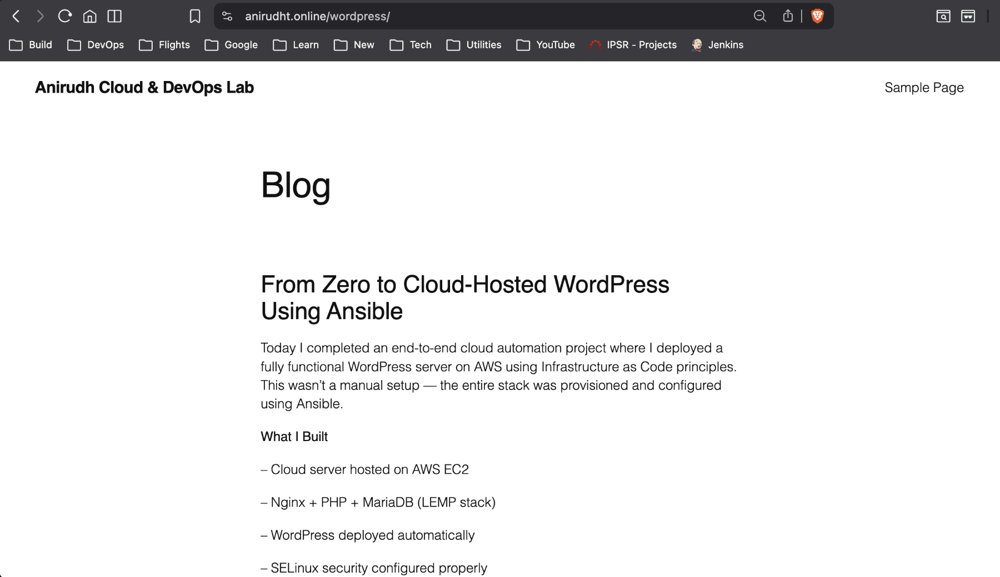

# Automated WordPress Deployment on AWS using Ansible

## Overview
This project demonstrates Infrastructure as Code by automating the deployment of a production-ready WordPress stack on AWS EC2 using Ansible.

Instead of manual server setup, the entire environment is provisioned through reusable automation scripts.

---

## Features

- Automated LEMP stack setup (Nginx, MariaDB, PHP)
- WordPress deployment via Ansible playbooks
- SELinux-aware configuration and custom web-root mapping
- Infrastructure as Code using Ansible
- Automated database backups to Amazon S3
- IAM role–based authentication (no credentials stored)
- Custom domain mapping (DNS configuration)
- HTTPS enabled using Let's Encrypt SSL
- Cloud networking and security group configuration

---

## Architecture

Client → Domain → EC2 (Nginx + PHP) → MariaDB  
Backup Flow: MariaDB → Backup Script → Amazon S3

---

## Project Structure

```
wordpress-aws-ansible-deployment/
│
├── ansible.cfg
├── inventory.ini
├── setup_wordpress_cloud.yml
│
├── group_vars/
│   └── all.yml
│
├── files/
│   └── db_backup.sh
```

---

## How to Use

1. Update variables in `group_vars/all.yml`
2. Add server details in `inventory.ini`
3. Run the playbook:

```bash
ansible-playbook setup_wordpress_cloud.yml
```

---

## Learning Outcomes

This project strengthened my understanding of:

- Linux server administration
- SELinux security configuration
- Infrastructure as Code concepts
- Automation using Ansible
- Cloud networking and IAM roles
- Backup strategies for production systems
- HTTPS configuration and web security

---

## Application Preview



---
